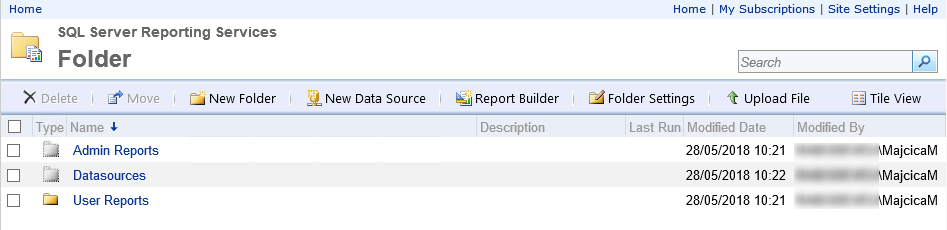

# Deploy SSRS Task

## Overview

This extension will add a Build/Release task in your TFS/VSTS instance that will allow you to deploy Microsoft SQL Server Reporting Services reports, datasources and datasets.
Aside of deploying reports, datasources and datasets it will also enable you to supply a configuration in form of xml or json file where you are going to specify folders structure and the reports that are going to be deployed in them. Optionally, in the configuration file, you will be able to specify security that needs to be applied on the deployed objects. Objects that you can manage and deploy are folders, data sources, datasets and reports.

## Requirements

For this task to run you will need at least PowerShell v5 installed on your agent server.

## Parameters

Different parameters of the task are explained below:

* **ReportService2010 endpoint URL**: The Report Server Web service ReportService2010 endpoint URL. E.g. `http://your.server/ReportServer/ReportService2010.asmx?wsdl`
* **Authentication**: Select the authentication mode for connecting to the SQL Server. In Windows authentication mode, the administrator's account, as specified in the Machines section, is used to connect to the SQL Server. In SQL Server Authentication mode, the SQL login and Password have to be provided in the parameters below.
* **Username**:  Provide the SQL login to connect to the SQL Server. The option is only available if SQL Server Authentication mode has been selected.
* **Password**: Provide the Password of the SQL login. The option is only available if SQL Server Authentication mode has been selected.
* **Report Files Path**: Path of the folder containing RDL and/or RSD files or on a UNC path like, `\\BudgetIT\Web\Deploy\`. The UNC path should be accessible to the machine's administrator account. Environment variables are also supported, like `$env:windir`, `$env:systemroot`, `$env:windir\FabrikamFibre\DB`. Wildcards can be used. For example, `**/*.rdl` for RDL files present in all sub folders.
* **SSRS configuration file**: Location of the XML or JSON configuration file.
* **SSIS folder Name**: Folder name in the SSIS Package Store.
* **Reference DataSources**: If selected the DataSources in the configuration file will be referenced in the Reports, by matching the DataSource name.
* **Reference DataSets**: If selected the DataSets in the configuration file will be referenced in the Reports, by matching the DataSets name.
* **Overwrite existing objects**: If selected overwrites objects in the same path that already do exists.

## Example of the configuration file

Considering that there is no official way to specify the path where a report should be deployed, a custom configuration file is provided to the task to indicate the right location.
Aside of the path itself, you can specify the permissions for both folders that we previously indicated as for the report and datasets themselves.

Folders and the inside objects are listed in the configuration file as hierarchical tree structure.

Following an example of the configuration file.

```xml
<?xml version="1.0" encoding="utf-8"?>
<Folder xmlns:xsi="http://www.w3.org/2001/XMLSchema-instance" 
  xmlns:xsd="http://www.w3.org/2001/XMLSchema" Name="Root">
  <Folders>
    <Folder Name="Folder">
      <Folders>
        <Folder Name="Datasources" Hidden="true">
          <DataSources>
            <DataSource ConnectionString="Data Source={{Server}}\{{Instance}};Initial Catalog=MyDB" Name="MyDB" Extension="SQL" CredentialRetrieval="Integrated" />
            <DataSource ConnectionString="Data Source={{Server}};Initial Catalog=MetaData" Name="MetaData" Extension="SQL" CredentialRetrieval="Store" UserName="user" Password="password" WindowsCredentials="True" />
          </DataSources>
        </Folder>
        <Folder Name="Admin Reports" Hidden="true">
          <Reports>
            <Report Name="Error Report" Hidden="true" FileName="Error Report.rdl" />
            <Report Name="Error Report for Export" Hidden="true" FileName="Error Report for Export.rdl" />
          </Reports>
          <Security>
            <Security Name="Administrator">
              <Roles>
                <Role>Browser</Role>
                <Role>Content Manager</Role>
              </Roles>
            </Security>
          </Security>
        </Folder>
        <Folder Name="User Reports">>
          <Reports>
            <Report Name="Users report" Hidden="false" FileName="UserReport.rdl" />
          </Reports>
          <Folders>
            <Reports>
              <Report Name="Other report" Hidden="false" FileName="OtherReport.rdl" />
            </Reports>
          </Folders>
        </Folder>
      </Folders>
      <Security>
        <Security Name="Users">
          <Roles>
            <Role>Browser</Role>
          </Roles>
        </Security>
        <Security Name="Administrator">
          <Roles>
            <Role>Browser</Role>
            <Role>Content Manager</Role>
          </Roles>
        </Security>
      </Security>
    </Folder>
  </Folders>
</Folder>
```

Values that you see in double curly braces are placeholders that are going to be substituted in the release just before the deployment.

Following is an example of how will this configuration file translate in SSRS.



### More information about the configuration file and various options

Datasources are to be specified in a configuration file and they are not importable as .rds files. This is so that they can easily be manipulated on per environment basis.
Not all of the authentication types are implemented for datasources. Prompt credentials are not supported.

The same configuration can also be expressed as a json file with the equivalent structure.

## Release notes

* 1.0.4 - Fixed an issue with loading the configuration file and unicode [#15](https://github.com/mmajcica/DeploySsrs/issues/15)
* 1.0.3 - Fixed an issue with Groups and Roles security. [#11](https://github.com/mmajcica/DeploySsrs/issues/11)
* 1.0.2 - Fixed an issue with Dataset references. [PR1](https://github.com/mmajcica/DeploySsrs/pull/1)
* 1.0.1 - Initial release

## Contributing

Feel free to notify any issue in the issues section of this GitHub repository. In order to build this task, you will need Node.js and gulp installed. Once cloned the repository, just run 'npm install' then 'gulp package' and in the newly created folder called _packages you will find a new version of the extension.
